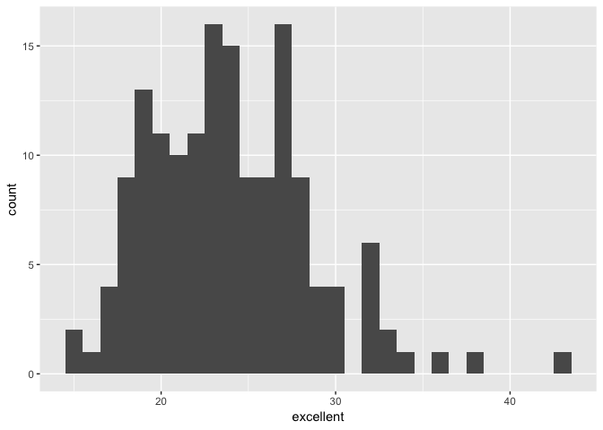
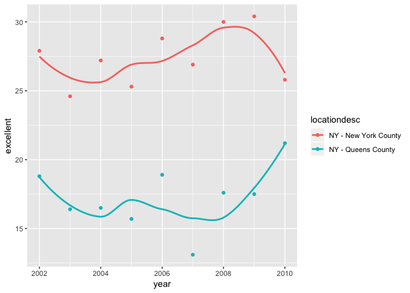

p8105\_hw2\_xy2395
================
Jack Yan
9/27/2018

``` r
library(tidyverse)
library(readxl)
library(p8105.datasets)
```

Problem 1
=========

Data Import and Manipulation
----------------------------

``` r
data_nysubway = 
  read_csv(file = "./data/NYC_Transit_Subway_Entrance_And_Exit_Data.csv") %>% 
  janitor::clean_names() %>% 
  select(-division, -exit_only, -(staffing:staff_hours), -(ada_notes:entrance_location)) %>% 
  mutate( entry = recode(entry, "YES" = TRUE, "NO" = FALSE))

head(data_nysubway)
```

    ## # A tibble: 6 x 19
    ##   line  station_name station_latitude station_longitu… route1 route2 route3
    ##   <chr> <chr>                   <dbl>            <dbl> <chr>  <chr>  <chr> 
    ## 1 4 Av… 25th St                  40.7            -74.0 R      <NA>   <NA>  
    ## 2 4 Av… 25th St                  40.7            -74.0 R      <NA>   <NA>  
    ## 3 4 Av… 36th St                  40.7            -74.0 N      R      <NA>  
    ## 4 4 Av… 36th St                  40.7            -74.0 N      R      <NA>  
    ## 5 4 Av… 36th St                  40.7            -74.0 N      R      <NA>  
    ## 6 4 Av… 45th St                  40.6            -74.0 R      <NA>   <NA>  
    ## # ... with 12 more variables: route4 <chr>, route5 <chr>, route6 <chr>,
    ## #   route7 <chr>, route8 <int>, route9 <int>, route10 <int>,
    ## #   route11 <int>, entrance_type <chr>, entry <lgl>, vending <chr>,
    ## #   ada <lgl>

The code above

-   imported data from the `.csv` file, and cleaned up variable names using `clean_names` function.
-   It also selected variables to be used from the original dataset. Now the dataset contains variables of line, station name, station latitude & longitude, routes served, entrance type, entry, vending, and ADA compliance.
-   Further, it converted the entry variable from character (`YES` vs `NO`) to a logical variable.
-   The dataset has 1868 rows (observations) and 19 columns (variables).
-   The data are not yet tidy, because the routes that each station supports are spead along variables from route1 to route11. I will fix this problem as instructed in Question 4.

A datailed list of variables in this dataset is shown below:

``` r
# Show all the variables in data_nysubway
names(data_nysubway)
```

    ##  [1] "line"              "station_name"      "station_latitude" 
    ##  [4] "station_longitude" "route1"            "route2"           
    ##  [7] "route3"            "route4"            "route5"           
    ## [10] "route6"            "route7"            "route8"           
    ## [13] "route9"            "route10"           "route11"          
    ## [16] "entrance_type"     "entry"             "vending"          
    ## [19] "ada"

Questions
---------

### Question 1

How many distinct stations are there?

``` r
data_nysubway = mutate(data_nysubway, station_name_line = paste(station_name, line))
distinct_station_name_line = distinct(data_nysubway, station_name_line)

# Count the rows in distinct_station_name_line
nrow(distinct_station_name_line)
```

    ## [1] 465

There are 465 stations.

### Question 2

How many stations are ADA compliant?

``` r
distinct_ada_compliant = 
  data_nysubway %>% 
  filter(ada == TRUE) %>% 
  distinct(station_name_line)

# Count the rows in distinct_ada_compliant
nrow(distinct_ada_compliant)
```

    ## [1] 84

There are 84 ADA compliant stations.

### Question 3

What proportion of station entrances / exits without vending allow entrance?

``` r
# Number of entrances / exits without vending
n_without_vending =
  data_nysubway %>% 
  filter( vending == "NO") %>% 
  nrow()

# Number of entrances / exits without vending that allow entrance
n_without_vending_allow_entrance = 
  data_nysubway %>% 
  filter( vending == "NO") %>% 
  filter( entry == TRUE) %>% 
  nrow()

# Calculate the proportion this question asks for
n_without_vending_allow_entrance / n_without_vending
```

    ## [1] 0.3770492

The proportion of station entrances / exits without vending allow entrance is 0.38.

### Question 4

Reformat data so that route number and route name are distinct variables. How many distinct stations serve the A train? Of the stations that serve the A train, how many are ADA compliant?

The code below uses `gather` to tidy the data so that each value in the previous variables (from `route1` to `route11`) is gathered into a new variable `route_served`. Then filter out rows containing `NA`s in the `route_served` variable and delete the unnecessary `route_number` variable.

``` r
# Tidy the dataset
tidy_data_nysubway = 
  gather(data_nysubway, key = route_number, value = route_served, route1:route11) %>% 
  filter(route_served != 'NA') %>% 
  select(-route_number)

# Count distinct stations serving the A train
tidy_data_nysubway %>% 
  filter(route_served == "A") %>% 
  distinct(station_name_line) %>% 
  nrow()
```

    ## [1] 60

``` r
# Count ADA compliant stations that serve the A train
tidy_data_nysubway %>% 
  filter(route_served == "A") %>% 
  filter(ada == TRUE) %>% 
  distinct(station_name_line) %>% 
  nrow()
```

    ## [1] 17

There are 60 distinct stations serving the A train, and 17 of them are ADA compliant.

Problem 2
=========

Mr. Trash Wheel Dataset
-----------------------

Import the Mr. Trash Wheel dataset from the `.xlsx` file and clean the variable names, then omit rows that do not include dumpster-specific data. Further, round the number of sports balls to the nearest integer and converts the result to an integer variable using `as.integer`.

``` r
data_mrtw = 
  read_excel("./data/HealthyHarborWaterWheelTotals2017-9-26.xlsx",range = 'A2:N256') %>% 
  janitor::clean_names() %>% 
  filter(dumpster != "NA") %>% 
  mutate(sports_balls = as.integer(sports_balls))

head(data_mrtw)
```

    ## # A tibble: 6 x 14
    ##   dumpster month  year date                weight_tons volume_cubic_ya…
    ##      <dbl> <chr> <dbl> <dttm>                    <dbl>            <dbl>
    ## 1        1 May    2014 2014-05-16 00:00:00        4.31               18
    ## 2        2 May    2014 2014-05-16 00:00:00        2.74               13
    ## 3        3 May    2014 2014-05-16 00:00:00        3.45               15
    ## 4        4 May    2014 2014-05-17 00:00:00        3.1                15
    ## 5        5 May    2014 2014-05-17 00:00:00        4.06               18
    ## 6        6 May    2014 2014-05-20 00:00:00        2.71               13
    ## # ... with 8 more variables: plastic_bottles <dbl>, polystyrene <dbl>,
    ## #   cigarette_butts <dbl>, glass_bottles <dbl>, grocery_bags <dbl>,
    ## #   chip_bags <dbl>, sports_balls <int>, homes_powered <dbl>

Precipitation Dataset
---------------------

The following code trunk reads and cleans precipitation data for 2016 and 2017. For each, omit rows without precipitation data and add a variable year. Next, combine datasets and convert month to a character variable.

``` r
data_prcpttn_2016 = 
    read_excel("./data/HealthyHarborWaterWheelTotals2017-9-26.xlsx", sheet = '2016 Precipitation', range = "A2:B14") %>% 
    janitor::clean_names() %>% 
    filter(total != "NA") %>% 
    mutate(year = 2016)
    
data_prcpttn_2017 = 
    read_excel("./data/HealthyHarborWaterWheelTotals2017-9-26.xlsx", sheet = '2017 Precipitation', range = "A2:B14")  %>% 
    janitor::clean_names() %>% 
    filter(total != "NA") %>% 
    mutate(year = 2017)

# Combine datasets for years 2016 and 2017
data_prcpttn = bind_rows(data_prcpttn_2016, data_prcpttn_2017) %>% 
    mutate(month = month.name[month]) %>% 
    select(year, month, total)

# Check the combined dataset
head(data_prcpttn)
```

    ## # A tibble: 6 x 3
    ##    year month    total
    ##   <dbl> <chr>    <dbl>
    ## 1  2016 January   3.23
    ## 2  2016 February  5.32
    ## 3  2016 March     2.24
    ## 4  2016 April     1.78
    ## 5  2016 May       5.19
    ## 6  2016 June      3.2

Interpretation
--------------

There are 215 observations and 14 variables in the Mr. Trash Wheel dataset, and 20 observations and 3 variables in the precipitation dataset. Key variables in the Mr. Trash Wheel dataset include `dumpster`, `weight_tons`, number of different items (such as `sports_balls`) and `homes_powered`. For the precipitation dataset, the key variable is `total`, which denotes the volumn of precipitation for each month. The total precipitation in 2017 was 29.93. The median number of sports balls in a dumpster in 2016 was 26.

Problem 3
=========

Data Import and Cleaning
------------------------

The following code trunk

-   formats the data to use appropriate variable names using `clean_names()`,
-   focuses on the “Overall Health” topic using `filter()`, and
-   excludes variables for class, topic, question, sample size, and everything from lower confidence limit to GeoLocation using `select()`.

``` r
tidy_brfss = 
  brfss_smart2010 %>% 
  janitor::clean_names() %>% 
  filter(topic == "Overall Health")  %>% 
  select(-(class:question), -sample_size, -(confidence_limit_low : geo_location)) 
```

The following code trunk

-   structures data so that responses (excellent to poor) are variables taking the value of `data_value`, using `spread()`,
-   sort the variables from `excellent` to `poor`, and
-   creates a new variable showing the proportion of responses that were “Excellent” or “Very Good”.

``` r
structured_brfss = 
  tidy_brfss %>% 
  spread(key = response, value = data_value) %>% 
  janitor::clean_names() %>% 
  select(year, locationabbr, locationdesc, excellent, very_good, good, fair, poor) %>% 
  mutate(excellent_and_very_good = excellent + very_good)
```

Questions
---------

### Summary of Answers

-   There are 404 unique locations included in the dataset.
-   There are 51 distinct locations in the variable `locationabbr`, representing all the 50 states and DC.
-   NJ is observed the most.
-   The median of the “Excellent” response value in 2002 was 23.6.

Code calculating these questions are shown below:

### Question 1

How many unique locations are included in the dataset?

``` r
distinct(structured_brfss, locationdesc) %>% 
  nrow()
```

    ## [1] 404

There are 404 unique locations (counties) in the dataset.

### Question 2

Is every state represented?

``` r
distinct_locations = distinct(structured_brfss, locationabbr) 

# number of distinct locations
nrow(distinct_locations)
```

    ## [1] 51

``` r
# check if each state is represented
state.abb %in% distinct_locations$locationabbr 
```

    ##  [1] TRUE TRUE TRUE TRUE TRUE TRUE TRUE TRUE TRUE TRUE TRUE TRUE TRUE TRUE
    ## [15] TRUE TRUE TRUE TRUE TRUE TRUE TRUE TRUE TRUE TRUE TRUE TRUE TRUE TRUE
    ## [29] TRUE TRUE TRUE TRUE TRUE TRUE TRUE TRUE TRUE TRUE TRUE TRUE TRUE TRUE
    ## [43] TRUE TRUE TRUE TRUE TRUE TRUE TRUE TRUE

``` r
# Why 51 distinct locations out of 50 states?
distinct_locations = 
(distinct_locations$locationabbr %in% state.abb) %>% 
  mutate(distinct_locations, is_state = .)
# Find out the 1 more location
distinct_locations$locationabbr[which(distinct_locations$is_state == FALSE)]
```

    ## [1] "DC"

Yes, each of the 50 states is represented, and DC is also observed.

### Question 3

What state is observed the most?

``` r
states_observed_ordered_list = 
  count(structured_brfss, locationabbr) %>% 
  arrange(desc(n)) 
head(states_observed_ordered_list)
```

    ## # A tibble: 6 x 2
    ##   locationabbr     n
    ##   <chr>        <int>
    ## 1 NJ             146
    ## 2 FL             122
    ## 3 NC             115
    ## 4 WA              97
    ## 5 MD              90
    ## 6 MA              79

``` r
# Full name of the state ranked 1st
state.name[which(state.abb == states_observed_ordered_list$locationabbr[1])]
```

    ## [1] "New Jersey"

NJ (New Jersy) is observed the most.

### Question 4

In 2002, what is the median of the “Excellent” response value?

``` r
structured_brfss_2002 = filter(structured_brfss, year == 2002) 
median(structured_brfss_2002$excellent, na.rm = TRUE)
```

    ## [1] 23.6

The median is 23.6.

Graphs
------

### Histogram

Make a histogram of “Excellent” response values in the year 2002.

``` r
ggplot(structured_brfss_2002, aes(x = excellent)) + 
  geom_histogram(binwidth = 1, na.rm = T) 
```



### Scatterplot

Make a scatterplot showing the proportion of “Excellent” response values in New York County and Queens County (both in NY State) in each year from 2002 to 2010.

``` r
structured_brfss_ny = 
  structured_brfss %>% 
  filter(year>=2002, year<=2010) %>% 
  filter(locationdesc == "NY - Queens County" | locationdesc ==  "NY - New York County")

ggplot(structured_brfss_ny, aes(x = year, y = excellent, color = locationdesc)) + 
  geom_point() +
  geom_smooth (se = FALSE)
```

    ## `geom_smooth()` using method = 'loess' and formula 'y ~ x'


